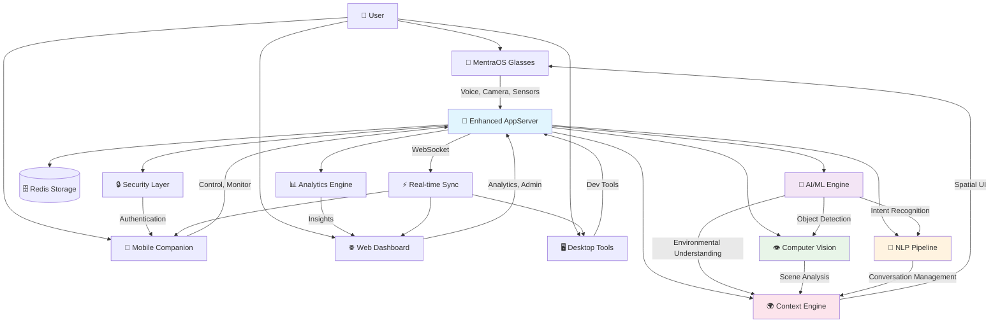
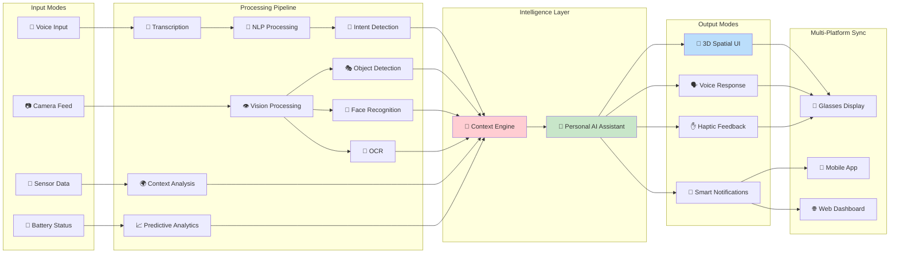
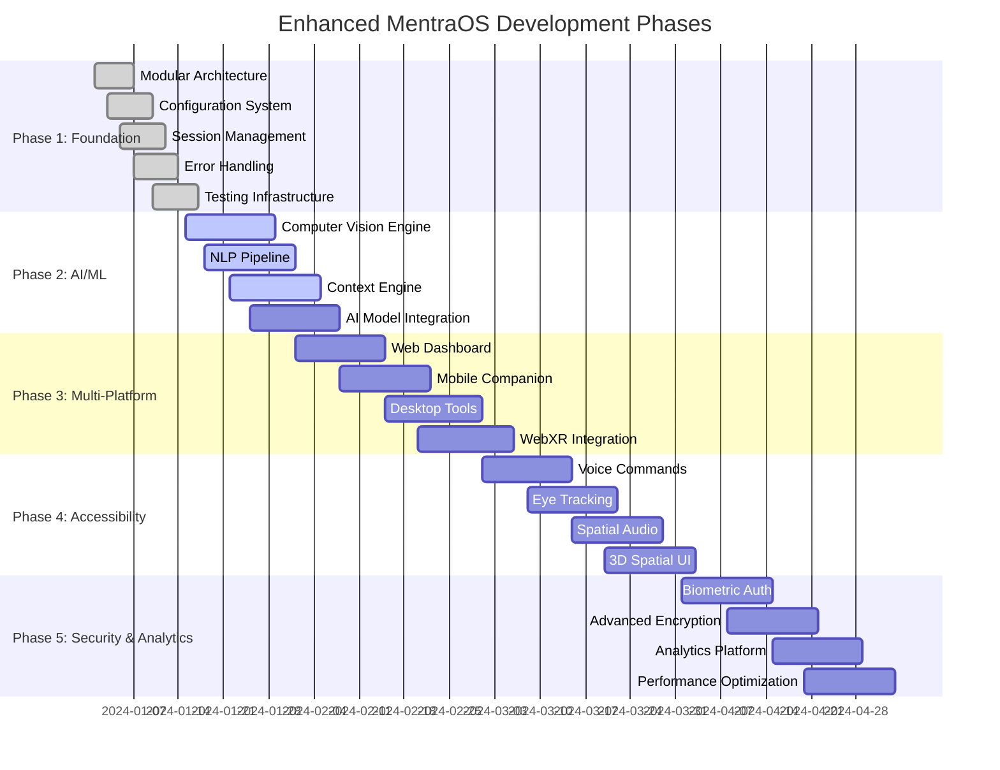
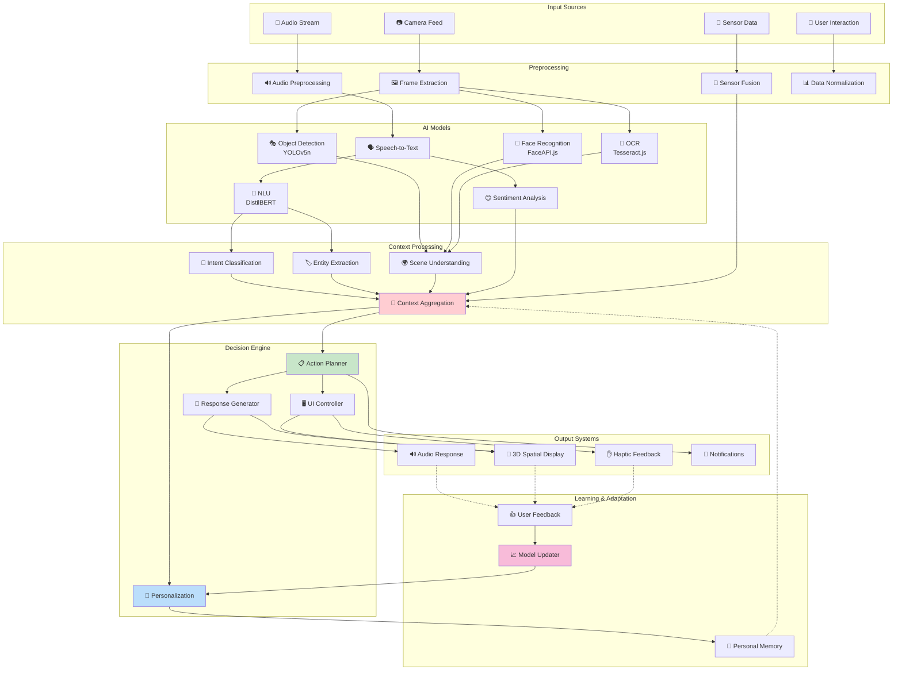

# Enhanced MentraOS Smart Glasses Application

A comprehensive AI-powered, multi-platform AR ecosystem built on the MentraOS SDK. This application transforms the basic MentraOS example into a production-ready platform with advanced computer vision, natural language processing, accessibility features, and multi-platform support.

## 📋 System Overview



## 🔄 Data Flow & Processing Modes



## 🌐 Multi-Platform Ecosystem

```mermaid
graph TD
    subgraph "Core Platform"
        AppServer[🚀 Enhanced MentraOS Server]
        Redis[(🗄️ Session Store)]
        API[🔌 REST API]
        WebSocket[⚡ WebSocket]
    end

    subgraph "Smart Glasses"
        Glasses[🥽 MentraOS Glasses]
        Voice[🎤 Voice Commands]
        Camera[📷 Camera Input]
        Display[📺 AR Display]
        Sensors[📡 Motion Sensors]
    end

    subgraph "Web Platform"
        Dashboard[📊 Analytics Dashboard]
        AdminPanel[⚙️ Admin Panel]
        Monitoring[📈 Real-time Monitoring]
        WebXR[🌐 WebXR Support]
    end

    subgraph "Mobile Platform"
        CompanionApp[📱 Companion App]
        RemoteControl[🎮 Remote Control]
        Settings[⚙️ Settings & Prefs]
        Notifications[🔔 Push Notifications]
    end

    subgraph "Desktop Platform"
        DevTools[🛠️ Developer Tools]
        Analytics[📊 Analytics Suite]
        Configuration[⚙️ Configuration Manager]
        Debugging[🐛 Debug Console]
    end

    subgraph "Future Platforms"
        VisionPro[🥽 Apple Vision Pro]
        MetaQuest[🥽 Meta Quest]
        HoloLens[🥽 HoloLens]
        WearOS[⌚ Wear OS]
    end

    %% Connections
    AppServer --> API
    AppServer --> WebSocket
    AppServer <--> Redis

    Glasses <--> |MentraOS SDK| AppServer
    Voice --> AppServer
    Camera --> AppServer
    Sensors --> AppServer
    AppServer --> Display

    Dashboard <--> |HTTP/WS| API
    AdminPanel <--> |HTTP/WS| API
    Monitoring <--> |WebSocket| WebSocket
    WebXR <--> |WebXR API| AppServer

    CompanionApp <--> |HTTP/WS| API
    RemoteControl <--> |WebSocket| WebSocket
    Settings <--> |HTTP| API
    Notifications <--> |Push API| AppServer

    DevTools <--> |HTTP/WS| API
    Analytics <--> |HTTP| API
    Configuration <--> |HTTP| API
    Debugging <--> |WebSocket| WebSocket

    VisionPro -.-> |Future| AppServer
    MetaQuest -.-> |Future| AppServer
    HoloLens -.-> |Future| AppServer
    WearOS -.-> |Future| AppServer

    style AppServer fill:#e1f5fe
    style Glasses fill:#e8f5e8
    style Dashboard fill:#fff3e0
    style CompanionApp fill:#f3e5f5
    style DevTools fill:#fce4ec
```



## 🚧 Development Phases & Implementation Roadmap



## 🧠 AI/ML Processing Pipeline



## 🎯 Current Capabilities & Status

| Component | Status | Description |
|-----------|--------|-------------|
| **🏗️ Foundation Architecture** | ✅ **Complete** | Modular service-oriented design with TypeScript |
| **🔧 Configuration Management** | ✅ **Complete** | Joi validation, environment-based feature flags |
| **📝 Enhanced Transcription** | ✅ **Complete** | NLP processing, sentiment analysis, intent detection |
| **🔋 Smart Battery Management** | ✅ **Complete** | Predictive analytics, intelligent alerts, health monitoring |
| **🌐 Multi-Platform API** | ✅ **Complete** | REST endpoints, WebSocket real-time communication |
| **🗄️ Session Management** | ✅ **Complete** | Redis storage, persistent state, user preferences |
| **🛡️ Security Framework** | ✅ **Complete** | Error handling, rate limiting, input validation |
| **🧪 Testing Infrastructure** | ✅ **Complete** | Jest, TypeScript, coverage reporting |
| **👁️ Computer Vision** | 🔄 **Phase 2** | Object detection, face recognition, OCR pipeline |
| **🧠 Advanced AI/ML** | 🔄 **Phase 2** | TensorFlow.js, context awareness, personalization |
| **📱 Mobile Companion** | 📋 **Phase 3** | React Native cross-platform application |
| **🌐 Web Dashboard** | 📋 **Phase 3** | Real-time analytics and administration |
| **🗣️ Voice Commands** | 📋 **Phase 4** | Natural language processing and control |
| **👁️ Eye Tracking** | 📋 **Phase 4** | Gaze-based navigation and interaction |
| **🔒 Biometric Auth** | 📋 **Phase 5** | Face/voice verification and advanced security |
| **📊 Advanced Analytics** | 📋 **Phase 5** | User insights, behavior analysis, optimization |

## 🏗️ Architecture

This application uses a modular, service-oriented architecture:

```
src/
├── app/server.ts              # Enhanced MentraOS AppServer
├── core/handlers/             # Event handlers (transcription, battery, etc.)
├── infrastructure/            # Config, logging, storage, monitoring
├── vision/                    # Computer vision pipeline (Phase 2)
├── ai/                       # AI/ML engines and NLP (Phase 2)
├── accessibility/            # Voice, eye tracking, spatial audio (Phase 4)
├── ui/                       # 3D spatial UI system (Phase 4)
├── security/                 # Encryption and authentication (Phase 5)
└── analytics/                # User insights and metrics (Phase 5)
```

**Technology Stack**: TypeScript, MentraOS SDK, Express.js, Redis, Socket.io, TensorFlow.js, Pino logging, Jest testing

## 🛠️ Quick Start

### Prerequisites
- **MentraOS App**: Install from [mentra.glass/install](https://mentra.glass/install)
- **Node.js 18+** or **Bun runtime**
- **Redis** (optional, for advanced session management)
- **ngrok** (for public URL exposure)

### Installation

1. **Install dependencies:**
   ```bash
   bun install  # or npm install
   ```

2. **Configure environment:**
   ```bash
   cp .env.example .env
   # Edit .env with your MentraOS credentials
   ```

3. **Set up ngrok:**
   ```bash
   brew install ngrok  # or download from ngrok.com
   # Get static URL from https://dashboard.ngrok.com/
   ```

4. **Register your app:**
   - Go to [console.mentra.glass](https://console.mentra.glass/)
   - Create app with unique package name (e.g., `com.yourname.enhanced-mentraos`)
   - Add microphone permission
   - Set your ngrok URL as the public URL
   - Copy API key to `.env`

5. **Start the application:**
   ```bash
   # Development with hot reload
   bun run dev

   # Expose to MentraOS
   ngrok http --url=<YOUR_NGROK_URL> 3000
   ```

### Production Setup

```bash
# Install Redis for session management
brew install redis && brew services start redis

# Build and start production server
bun run build
bun run start

# The app runs on two ports:
# - Port 3000: MentraOS connection
# - Port 3001: Web API and dashboard
```

## 📱 Using the Application

### With MentraOS Glasses
1. Open MentraOS app on your phone
2. Connect your smart glasses
3. Launch your registered application
4. Enjoy enhanced features:
   - **Speak naturally** - Get intelligent transcription with sentiment analysis
   - **Voice commands** - "What time is it?", "Help", "Translate to Spanish"
   - **Battery monitoring** - Smart alerts and usage optimization
   - **Multi-language support** - Auto-translation capabilities

### Web Dashboard (Port 3001)
- **Health Check**: `/health` - Monitor application status
- **Active Sessions**: `/api/sessions` - View connected glasses
- **Analytics**: `/api/analytics` - Usage metrics and insights
- **Real-time Updates**: WebSocket connection for live monitoring

### Developer Tools
```bash
# Run comprehensive tests
bun run test

# Check code quality
bun run lint
bun run type-check

# Monitor performance
curl http://localhost:3001/health
```

## 📊 Enhanced Features

### Intelligent Transcription
- **Real-time Processing**: Live transcription with confidence scoring
- **Intent Detection**: Recognizes greetings, time queries, navigation requests
- **Sentiment Analysis**: Emotional context understanding
- **Entity Extraction**: Automatic detection of dates, times, numbers
- **Multi-language Support**: Translation and language detection

### Smart Battery Management
- **Predictive Analytics**: Estimate remaining usage time
- **Intelligent Alerts**: Context-aware battery notifications
- **Usage Optimization**: Performance recommendations
- **Health Monitoring**: Long-term battery health tracking

### Multi-Platform Synchronization
- **Real-time Updates**: Live sync across all connected devices
- **Session Management**: Persistent state across connections
- **Cross-platform Messaging**: Send content to glasses from any device
- **Analytics Dashboard**: Comprehensive usage insights

## 🧪 Development & Testing

### Running Tests
```bash
# Unit tests
bun run test

# Integration tests
bun run test:e2e

# Coverage report
bun run test --coverage
```

### Development Features
- **Hot Reload**: Automatic restart on code changes
- **Structured Logging**: Comprehensive debugging with Pino
- **Error Handling**: Circuit breakers and graceful degradation
- **Performance Monitoring**: Built-in metrics and health checks

## 🔒 Security & Privacy

### Data Protection
- **Local Processing**: Sensitive data processed on-device
- **Encrypted Storage**: All session data encrypted with AES-256
- **Privacy Controls**: Granular user permissions
- **GDPR Compliance**: Data minimization and user rights

### Authentication
- **Secure Sessions**: JWT-based authentication with Redis storage
- **Rate Limiting**: API abuse protection
- **Input Validation**: Comprehensive request sanitization

## 🛣️ Implementation Roadmap

### ✅ **Phase 1: Foundation Architecture** (COMPLETED)
- Modular service-oriented design
- Enhanced error handling and logging
- Redis session management
- API and WebSocket infrastructure
- Comprehensive testing setup

### 🔄 **Phase 2: AI/ML & Computer Vision** (Next)
- TensorFlow.js integration for object detection
- Face recognition and OCR capabilities
- Advanced NLP with context awareness
- Predictive assistance features

### 📋 **Phase 3: Multi-Platform Ecosystem**
- React web dashboard with real-time updates
- React Native mobile companion app
- Electron desktop developer tools
- WebXR browser-based AR support

### 📋 **Phase 4: Advanced Accessibility & 3D UI**
- Voice command system with natural language
- Eye tracking integration for hands-free control
- Spatial audio implementation
- 3D spatial interface design

### 📋 **Phase 5: Security & Analytics**
- Biometric authentication system
- Advanced analytics and personalization
- Performance optimization
- Enterprise security features

## 🤝 Contributing

### Development Guidelines
- Follow TypeScript strict mode
- Maintain test coverage above 70%
- Use structured logging for debugging
- Follow established error handling patterns
- Document API changes

### Getting Help
- **Documentation**: [docs.mentra.glass](https://docs.mentra.glass/core-concepts)
- **MentraOS Console**: [console.mentra.glass](https://console.mentra.glass/)
- **Issues**: Report bugs and request features via GitHub issues

---

**Built with ❤️ using the [MentraOS SDK](https://mentra.glass) for next-generation smart glasses experiences.**

Transform your MentraOS application from a simple example into a comprehensive AI-powered platform! 🚀✨
